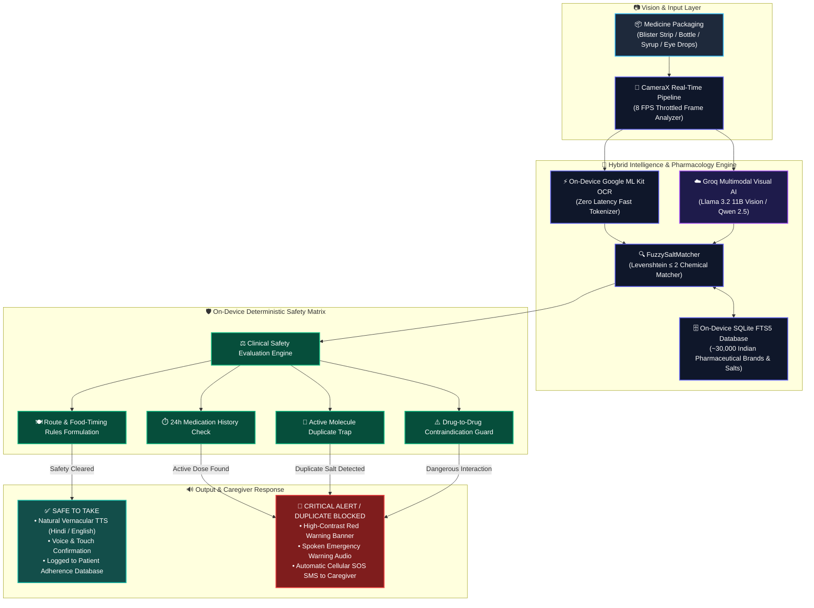

# 🛡️ MedVoice — Medication Safety & Vernacular Ambient Voice Assistant

> **Edge Medication Safety & Ambient Voice Assistant (Hybrid Edge-Cloud AI Architecture)**

[](https://github.com/AshrafGalaxy/MedVoice/releases/tag/v1.0.0)
[-0052CC?style=for-the-badge&logo=githubactions&logoColor=white)](app/src/test/java/com/medvoice/)
[](https://kotlinlang.org/)

---

## 🌟 Overview

**MedVoice** is a medication safety and ambient voice assistant application designed to protect elderly patients from accidental medication errors, duplicate dosage toxicity, and dangerous drug-to-drug interactions. 

MedVoice operates with a **Hybrid Edge-Cloud Architecture**:
- **On-Device Clinical Safety Matrix**: All drug contraindications, salt matches, duplicate dose warnings, and the ~30,000 Indian pharmaceutical brand SQLite FTS5 database execute deterministically on the physical device.
- **Multimodal Visual AI & OCR**: Combines on-device Google ML Kit Vision with cloud-hosted visual language models (Groq `llama-3.2-11b-vision-preview` & `Qwen 2.5`) to extract high-accuracy pharmaceutical brand names and active compositions from complex blister packs.
- **Vernacular Audio & Hands-Free Interaction**: Delivers instant spoken guidance in vernacular Indian languages (Hindi and English) with voice confirmation.



---

## ✨ Key Features

- **🛡️ Deterministic Clinical Safety Matrix:** All duplicate dose warnings, contraindications, and active salt evaluations run deterministically on the local SQLite FTS5 database before any action is confirmed.
- **👁️ Multimodal Visual AI & OCR:** Intelligently recognizes Blister Packs, Ophthalmic Eye Drops, Cough Syrups/Tonics, Topical Gels/Ointments, Inhalers, and Capsules using a hybrid edge-cloud vision pipeline.
- **📦 ~30,000 Indian Medicines Catalog:** Pre-indexed SQLite database with FTS5 virtual table covering commercial brands, salts, and manufacturers across India.
- **🎙️ Vernacular Speech & Hands-Free Confirmation:** Natural voice announcements in Hindi (`hi-IN`) and English (`en-IN`) with speech recognition for hands-free confirmation (*"हाँ ले ली"* / *"Yes taken"*).
- **⏰ Daily Spoken Voice Alarms:** `AlarmManager` wakeup alarms that announce prescription times aloud even when the phone is locked.
- **🚨 Direct Cellular SOS Dispatcher:** Offline GSM cellular SMS automatically sent to caregivers if a critical drug interaction or duplicate dose is attempted.
- **♿ Senior Accessibility (WCAG AAA):** High-contrast palette (`#00875A` Safe, `#DE350B` Alert), 48dp+ accessible touch targets, and zero layout cutoffs.

---

## 📂 Project Structure & Architecture

```
MedVoice/
├── app/
│   ├── src/main/assets/databases/
│   │   └── medvoice_master.db          # ~30k Indian medicines SQLite FTS5 catalog
│   ├── src/main/java/com/medvoice/
│   │   ├── core/
│   │   │   ├── ai/
│   │   │   │   ├── AiPharmacologyEngine.kt     # Multimodal Vision & Qwen AI engine
│   │   │   │   └── FuzzySaltMatcher.kt         # On-device fuzzy chemical matcher
│   │   │   ├── audio/
│   │   │   │   ├── VernacularTtsManager.kt     # Multi-engine TTS (Device / Sarvam / ElevenLabs)
│   │   │   │   └── VoiceConfirmationListener.kt# Hands-free speech listener
│   │   │   ├── data/local/
│   │   │   │   ├── AppDatabase.kt              # Room database master configuration
│   │   │   │   ├── dao/MedicineDao.kt          # FTS5 & log query interfaces
│   │   │   │   └── entity/Entities.kt          # MedicineEntity & MedicationLogEntity
│   │   │   ├── domain/engine/
│   │   │   │   └── SafetyEvaluationEngine.kt   # Two-tier lookup & safety pipeline
│   │   │   ├── scheduler/                      # Exact AlarmManager background scheduler
│   │   │   └── vision/
│   │   │       └── TextAnalyzer.kt             # Throttled ML Kit CameraX frame analyzer
│   │   ├── feature/
│   │   │   ├── scanner/                        # Real-time CameraX OCR scanner screen & HUD
│   │   │   ├── home/                           # Patient dashboard & schedule
│   │   │   ├── cabinet/                        # Searchable medicine catalogue & voice readout
│   │   │   ├── history/                        # Caregiver audit log screen
│   │   │   ├── settings/                       # Voice Studio & Diagnostics sandbox
│   │   │   └── onboarding/                     # 3-step accessible senior setup wizard
│   │   └── ui/                                 # Jetpack Compose high-contrast theme
│   └── test/                                   # 37 comprehensive unit tests (100% pass)
├── scripts/
│   └── compile_catalog_db.py                   # Automated CSV downloader & SQLite FTS5 compiler
└── AGENTS.md                                   # Autonomous agent system rules & directives
```

## 📱 Step-by-Step User Guide

### 1️⃣ Scan Any Medicine Packaging
* Navigate to the **Scan** tab.
* Align your camera over any blister pack, syrup bottle, eye drop container, or ointment tube.
* Tap the **Capture** button. MedVoice instantly analyzes the packaging, extracting the **Brand Name**, **Active Chemical Salts**, **Dosage Form**, and **Food/Timing Rules**.

### 2️⃣ Listen to Vernacular Spoken Guidance
* The app automatically announces the medicine details and dosage instructions aloud in your selected language (**Hindi** or **English**).
* Confirm your dose with a single tap on **"Confirm Dose Taken"** or hands-free via voice (*"हाँ ले ली"* / *"Yes taken"*).

### 3️⃣ Active Duplicate Dosage Protection
* If a patient attempts to scan and take the same active molecule again within the safety window:
  * 🚨 **Immediate Critical Alert**: The screen triggers a high-contrast red warning banner.
  * 🔊 **Audio Warning**: The voice announces aloud that the dose was already taken.
  * 📲 **Caregiver SOS Alert**: An automated emergency cellular SMS is immediately dispatched to the caregiver.

### 4️⃣ Review Daily Adherence in Caregiver Audit Log
* Open the **Caregiver** tab to view the complete chronological timeline of taken medicines.
* Monitor blocked overdose attempts, taken timestamps, and adherence scores.
* Tap **"Share with Doctor"** to generate an instant clinical summary for healthcare consultations.

---

## 🛠️ Tech Stack

```
Language             : Kotlin 2.0+ (Coroutines & StateFlow)
UI Toolkit           : Jetpack Compose + Material 3 (WCAG AAA High Contrast)
Target Android SDK   : Min SDK: 28 (Android 9.0) | Target SDK: 34 (Android 14)
Local Storage        : Android Jetpack Room 2.6+ with Native SQLite FTS5 (~30k medicines)
Vision Engine        : Google ML Kit On-Device Text Recognition v2 + Groq Multimodal Vision
AI Inference         : Groq llama-3.2-11b-vision-preview / Qwen 2.5 + LiteRT INT4
Speech Engine        : Native Android TextToSpeech (`hi-IN`, `en-IN`) + SpeechRecognizer
SMS Safety Gateway   : Android Telephony SmsManager (Offline Direct Cellular)
```

---

## 🚀 Quick Start & Build Instructions

### Prerequisites
- Android Studio Ladybug / Koala or newer
- Android SDK 34 & JDK 17+ (e.g., Android Studio JBR)
- Python 3.10+ (for dataset compilation script)

### 1. Compile the Catalog Database
```bash
python scripts/compile_catalog_db.py
```

### 2. Run Automated Unit Tests
```bash
.\gradlew testDebugUnitTest
```

### 3. Run Android Lint Checks
```bash
.\gradlew lintDebug
```

### 4. Build & Install to Device
```bash
.\gradlew assembleDebug
adb install -r app/build/outputs/apk/debug/app-debug.apk
```
